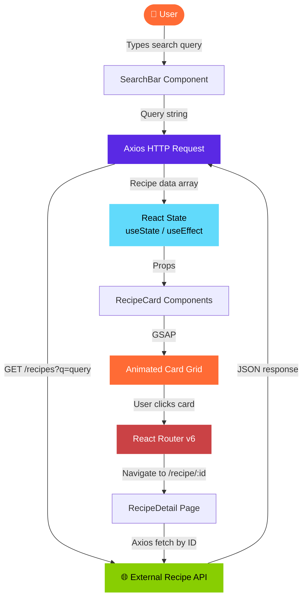

<div align="center">

```
██████╗ ███████╗ ██████╗██╗██████╗ ███████╗    ███████╗██╗███╗   ██╗██████╗ ███████╗██████╗ 
██╔══██╗██╔════╝██╔════╝██║██╔══██╗██╔════╝    ██╔════╝██║████╗  ██║██╔══██╗██╔════╝██╔══██╗
██████╔╝█████╗  ██║     ██║██████╔╝█████╗      █████╗  ██║██╔██╗ ██║██║  ██║█████╗  ██████╔╝
██╔══██╗██╔══╝  ██║     ██║██╔═══╝ ██╔══╝      ██╔══╝  ██║██║╚██╗██║██║  ██║██╔══╝  ██╔══██╗
██║  ██║███████╗╚██████╗██║██║     ███████╗    ██║     ██║██║ ╚████║██████╔╝███████╗██║  ██║
╚═╝  ╚═╝╚══════╝ ╚═════╝╚═╝╚═╝     ╚══════╝    ╚═╝     ╚═╝╚═╝  ╚═══╝╚═════╝ ╚══════╝╚═╝  ╚═╝
```

### 🍳 Search any dish. Discover the recipe. Cook it tonight.

<br/>

[](https://react.dev/)
[](https://vitejs.dev/)
[](https://gsap.com/)
[](https://axios-http.com/)

<br/>

[](https://react.semantic-ui.com/)
[](https://reactrouter.com/)
[](https://recipe-finder-website-s71p.vercel.app/)

<br/>

[](https://recipe-finder-website-s71p.vercel.app/)
[](https://github.com/aarav12e/Recipe_Finder_Website/stargazers)
[](https://github.com/aarav12e/Recipe_Finder_Website/commits/main)

</div>

---

## 🍽️ What is This?

**Recipe Finder** is a modern, animated React web app that lets you search for any dish or ingredient and instantly discover detailed recipes powered by an external API. It features smooth **GSAP animations**, a clean **Semantic UI** component library, and client-side routing — all deployed on Vercel.

> *"What's for dinner?"* — Type it. Find it. Cook it.

---

## 🌐 Live Demo

<div align="center">

### 👉 [recipe-finder-website-s71p.vercel.app](https://recipe-finder-website-s71p.vercel.app/)

*No setup. No login. Just search.*

</div>

---

## ✨ Features

| Feature | Description |
|---------|-------------|
| 🔍 **Recipe Search** | Search recipes by dish name or ingredient in real time |
| 🌐 **External API** | Fetches live recipe data from a recipe API via Axios |
| 🎬 **GSAP Animations** | Smooth entrance animations on cards and page transitions |
| 🃏 **Recipe Cards** | Clean card UI showing dish image, title, and quick info |
| 📄 **Recipe Detail Page** | Full ingredients list, instructions, and metadata |
| 🔀 **Client-side Routing** | Multi-page navigation via React Router v6 |
| 🎨 **Semantic UI React** | Polished, accessible UI components out of the box |
| ⚡ **Vite Powered** | Lightning-fast dev server and optimized production build |
| 📱 **Fully Responsive** | Works seamlessly on mobile, tablet, and desktop |
| 🚀 **Vercel Deployed** | Auto-deploys on every push to `main` |

---

## 🏗️ Architecture & Data Flow



---

## 🔄 User Flow

```
  🏠 LANDING PAGE
         │
         ▼
  ┌──────────────────────────────────────┐
  │   🔍  Search Bar                     │
  │   Type: "Biryani", "Pasta",          │
  │         "chicken", "tomato"...       │
  └───────────────┬──────────────────────┘
                  │
                  ▼
         Axios fires API call
                  │
                  ▼
  ┌──────────────────────────────────────┐
  │  🃏  Recipe Card Grid                │
  │                                      │
  │  ┌──────┐ ┌──────┐ ┌──────┐         │
  │  │ 🍛   │ │ 🍝   │ │ 🥗   │  ← GSAP │
  │  │Card 1│ │Card 2│ │Card 3│  fade-in│
  │  └──────┘ └──────┘ └──────┘         │
  └───────────────┬──────────────────────┘
                  │ Click a card
                  ▼
  ┌──────────────────────────────────────┐
  │  📄  Recipe Detail Page              │
  │                                      │
  │  🖼️  Full dish image                 │
  │  📋  Ingredients list                │
  │  👨‍🍳  Step-by-step instructions       │
  │  ⏱️   Cook time, servings, cuisine    │
  │  🔗  Source / credit link            │
  └──────────────────────────────────────┘
```

---

## 📁 Project Structure

```
Recipe_Finder_Website/
│
├── 📂 public/
│   └── index.html              ← Vite HTML entry template
│
├── 📂 src/
│   ├── 📂 components/
│   │   ├── SearchBar.jsx       ← Search input + submit handler
│   │   ├── RecipeCard.jsx      ← Individual recipe card with GSAP
│   │   └── Navbar.jsx          ← Top navigation bar
│   │
│   ├── 📂 pages/
│   │   ├── Home.jsx            ← Landing + search results page
│   │   └── RecipeDetail.jsx    ← Full recipe view page
│   │
│   ├── 📂 api/
│   │   └── recipeAPI.js        ← Axios instance + API call functions
│   │
│   ├── App.jsx                 ← Router setup + layout wrapper
│   ├── App.css                 ← Global styles
│   └── index.js                ← React DOM entry point
│
├── 📄 package.json             ← Dependencies & scripts
├── 📄 vercel.json              ← Vercel SPA routing config
├── 📄 .gitignore
└── 📄 README.md
```

---

## 🛠️ Tech Stack

| Layer | Technology | Purpose |
|-------|-----------|---------|
| **UI Library** |  | Component-based rendering |
| **Build Tool** |  | Fast HMR + production bundler |
| **Animations** |  | Smooth card & page animations |
| **HTTP Client** |  | API requests to recipe endpoint |
| **Routing** |  | Client-side multi-page navigation |
| **UI Components** |  | Cards, search, buttons, grid |
| **Testing** |  | Component unit tests |
| **Deploy** |  | Auto-deploy on push to main |

---

## 🎬 GSAP Animations

This project uses **GreenSock Animation Platform (GSAP)** via `@gsap/react` for buttery-smooth UI motion:

```javascript
import { useGSAP } from "@gsap/react";
import gsap from "gsap";

// Card entrance animation — staggered fade-in from below
useGSAP(() => {
    gsap.from(".recipe-card", {
        opacity: 0,
        y: 60,
        duration: 0.6,
        stagger: 0.1,          // Each card appears 0.1s after the last
        ease: "power2.out"
    });
}, [recipes]);                 // Re-runs whenever results update

// Page transition — smooth fade in
useGSAP(() => {
    gsap.from(".page-container", {
        opacity: 0,
        duration: 0.4,
        ease: "power1.inOut"
    });
}, []);
```

**Animations used across the app:**

```
  Search Results Load  →  Cards stagger in from bottom  ↑
  Card Hover           →  Subtle scale + shadow lift    ↗
  Page Navigation      →  Smooth opacity fade           ✨
  Detail Page Load     →  Image + content slide in      →
```

---

## 🌐 API Integration

The app communicates with an external **Recipe API** via Axios:

```javascript
// src/api/recipeAPI.js
import axios from "axios";

const BASE_URL = "https://api.spoonacular.com/recipes";

export const searchRecipes = async (query) => {
    const response = await axios.get(`${BASE_URL}/complexSearch`, {
        params: {
            query,
            apiKey: process.env.REACT_APP_API_KEY,
            number: 12,
            addRecipeInformation: true,
        }
    });
    return response.data.results;
};

export const getRecipeById = async (id) => {
    const response = await axios.get(`${BASE_URL}/${id}/information`, {
        params: { apiKey: process.env.REACT_APP_API_KEY }
    });
    return response.data;
};
```

---

## ⚙️ Environment Variables

Create a `.env` file in the root:

```env
# ─── Recipe API ─────────────────────────────────────────
REACT_APP_API_KEY=your_recipe_api_key_here
```

> ⚠️ Variables must be prefixed with `REACT_APP_` to be exposed in Create React App / Vite builds.
> Never commit your `.env` — it's already in `.gitignore`.

---

## 🚀 Getting Started

### Prerequisites

```bash
node --version    # v18+ recommended
npm --version     # v9+
```

### Installation & Dev

```bash
# 1. Clone the repository
git clone https://github.com/aarav12e/Recipe_Finder_Website.git
cd Recipe_Finder_Website

# 2. Install dependencies
npm install

# 3. Set up environment variables
cp .env.example .env
# → Add your REACT_APP_API_KEY

# 4. Start the dev server
npm start          # Opens at http://localhost:3000
```

### Build for Production

```bash
npm run build      # Outputs to /build folder
```

---

## ☁️ Deployment

Auto-deployed on **Vercel** — every push to `main` triggers a new deploy.

```
  📦 git push origin main
           │
           ▼
  🔁 Vercel detects changes
           │
           ▼
  ⚡ npm run build
           │
           ▼
  🌐 Live at recipe-finder-website-s71p.vercel.app
```

The `vercel.json` handles SPA routing so React Router works on direct URL access:

```json
{
  "rewrites": [{ "source": "/(.*)", "destination": "/index.html" }]
}
```

### Deploy your own fork

```bash
npm i -g vercel
vercel login
vercel --prod
```

> Add `REACT_APP_API_KEY` in **Vercel Dashboard → Settings → Environment Variables**.

---

## 📦 Dependencies

### Runtime

```json
{
  "react":              "^18.2.0",    // UI rendering
  "react-dom":          "^18.2.0",    // DOM bridge
  "react-router-dom":   "^6.20.0",    // Client-side routing
  "axios":              "^1.6.0",     // HTTP client for API
  "gsap":               "^3.14.2",    // Animation engine
  "@gsap/react":        "^2.1.2",     // React GSAP hooks
  "semantic-ui-react":  "^2.1.4",     // UI component library
  "semantic-ui-css":    "^2.5.0",     // Semantic UI styles
  "web-vitals":         "^2.1.4"      // Performance metrics
}
```

### Dev / Testing

```json
{
  "react-scripts":              "5.0.1",
  "@testing-library/react":     "^14.0.0",
  "@testing-library/jest-dom":  "^5.16.5",
  "@testing-library/user-event":"^14.5.0"
}
```

---

## 🤝 Contributing

```bash
# Fork → Clone → Branch
git checkout -b feature/your-idea

# Make changes → Commit
git commit -m "feat: add cuisine filter by country"

# Push → Open PR
git push origin feature/your-idea
```

**Ideas for contributions:**
- 🌍 Filter recipes by cuisine (Indian, Italian, Mexican...)
- ❤️ Bookmark / save favourite recipes
- 🛒 Auto-generate grocery list from ingredients
- 🌙 Dark mode
- 🔊 Read-aloud recipe instructions

---

## 👨‍💻 Author

<div align="center">

**Aarav Kumar**
*Frontend Developer · React · B.Tech CDS (2028) · Ignite Club*

[](https://github.com/aarav12e)
[](https://recipe-finder-website-s71p.vercel.app/)

</div>

---

<div align="center">

```
        🍳  ════════════════════════════════════  🍳
        
             import { dinner } from 'recipe-finder';
             
        🍳  ════════════════════════════════════  🍳
```

*Built with ❤️ and React — because every great meal starts with a great search*

**`< / Recipe_Finder_Website >`**

</div>
